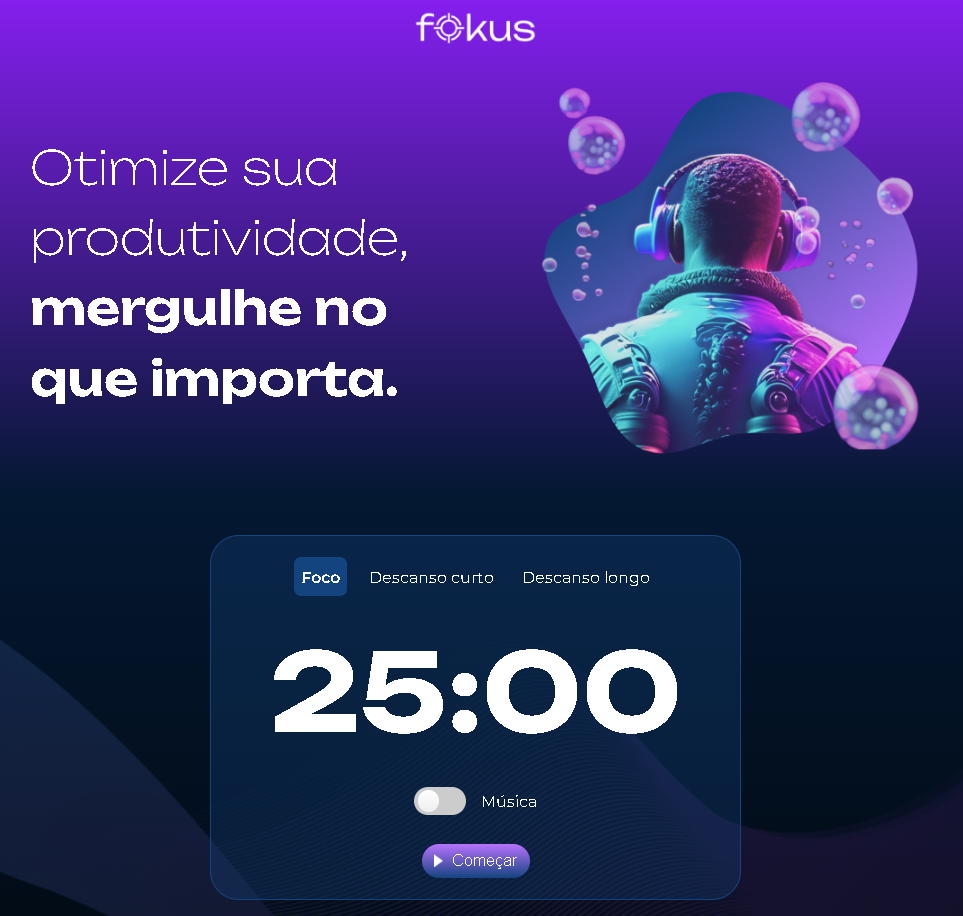

# Projeto Fokus

###



###

## Descrição do projeto
Projeto de um temporizador baseado no método Pomodoro, que consiste em focar em algo por certa quantia de tempo (que no nosso caso será 25 minutos), e descansar uma quantia de tempo (que no nosso caso será 5 ou 15 minutos).
No projeto utilizei um Switch, For Each, Date, entre outras coisas para deixar mais dinâmico e interativo. Não utilizei nesse projeto recursos como "onclick()", pois construi utilizando o método "addEventListener()".

O que foi reforçado nesse projeto:

- Recuperação de dados de input.
- Criação de listas.
- Mudança de texto dentro de uma tag.
- Manipulação de elementos na localStorage.
- Criação de eventos customizados.
- Entre outras coisas.

###

## Linguagens utilizadas no projeto
<div>
  
  
  
</div>

###

## Como Executar

Para executar este projeto localmente, siga os passos abaixo:

1. **Clone o repositório:**
    
    ```bash
    git clone https://github.com/LeozinGs/javascript-fokus
    ```
    
2. **Navegue até o diretório do projeto.**
3. **Abra o arquivo `index.html` em seu navegador:**
    
    Basta dar um duplo clique no arquivo `index.html` ou abrir manualmente em seu navegador preferido.